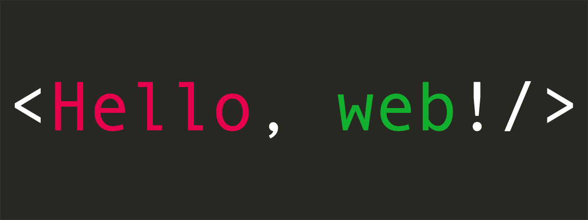

# Hello-Web



A fun project, purpose to implement the simplest HTTP server via popular programming languages.

## Features definition

HTTP server should accept a GET request on root path, and response a `Hello, web!` with 200 status.

```
# GET /

HTTP/1.1 200 OK
Content-Length: 11

Hello, web!
```

## Implementations

- [ ] C#
- [x] C
- [ ] Clojure
- [ ] Dart
- [ ] Erlang
- [ ] Go
- [ ] Haskell
- [ ] Java
- [ ] Julia
- [ ] Kotlin
- [ ] Node
- [ ] PHP
- [ ] Python
- [ ] Ruby
- [ ] Rust
- [ ] Scala
- [ ] Swift
- ... your suggestions

## Constraints

- Single file(for safty reason, binary file is not acceptable).
- No frameworks.
- Listen on port `8080`.
- Less code, and simple to use.

## Contribute

It's highly recommended that your implementation should include following files at least:

- source code file: `server.[language extension]`, eg: `server.php`.
- `.gitignore` file to exclude temporary files, complied binary files etc.
- a markdown document: `README.md`, about how to install/start-up.

> ~~ Thank you for contribution!

## LICENSE

MIT License

